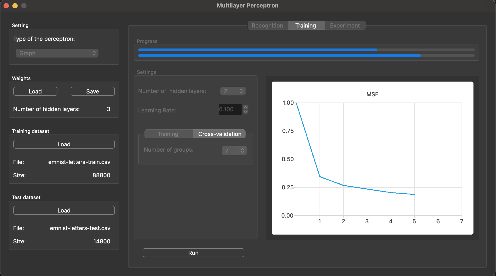
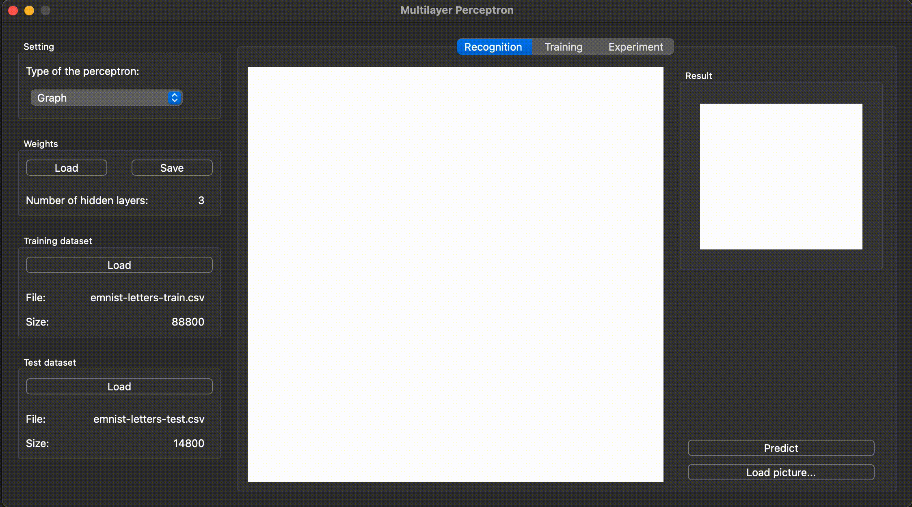

# Multilayer Perceptron v1.0
The "Multilayer Perceptron" is a modern app written in C++. The application represents a simple artificial neural network in the form of a perceptron, which can be trained on an open dataset and perform recognition of 26 handwritten letters of the Latin alphabet.

#### Program launch options

```
make run
```

## Features
- GUI implementation, based on QT6

  

- Load train and test datasets from a csv file.
- Choose the network topology with 2-5 hidden layers.
- Training with using the backpropagation method and sigmoid activation.
- Matrix form: all layers are represented as weight matrices.
- Graph form: each neuron is represented as some node object connected to other nodes by refs.
- Perform experiments on a selected portion of the test sample, defined by a floating-point number ranging from 0 to 1.
- Load BMP images (image size can be up to 512x512) with Latin letters and classify them.
- Draw two-color square images by hand and classify them.
- Real-time training process for a user-defined number of epochs with displaying the error values for each training epoch.
- Run the training process using cross-validation for a given number of groups k.
- Save to a file and load weights of perceptron from a file.

  

## Research

Comparison of the performance of two perceptron implementations: graph and matrix.
Carrying out testing with same topology on the test sample 10 times, 100 times and 1000 times.

The average results are as follows:

|  | 10 runs | 100 runs| 1000 runs | Average time of 1 run |
| ------------- | :-----: | :-----: | :-----: | :-----: | 
| Matrix perceptron | 26,76 sec. | 271,79 sec. | 2760.45 sec. | 2.76 sec. |
| Graph perceptron | 62,49 sec. | 620,58 sec. | 6162.90 sec. | 6.17 sec. |

### Test bench

iMac (Retina 5K, 27-inch, 2020)
Proccessor 3.1 GHz 6-Core Intel Core i5
Memory 40 GB 2133 MHz DDR4
Graphics AMD Radeon Pro 5300 4 GB

### Conclusion
Performance Comparison: The matrix-based perceptron demonstrates significantly faster execution times compared to the graph-based perceptron. This is evident across all experiment repetitions, with the matrix-based approach consistently outperforming the graph-based one.

Scaling Effect: As the number of experiments increases, the execution time for both implementations also increases. However, the graph-based perceptron shows more significant increase in execution time in training model compared to the matrix-based perceptron. This suggests that the back propagation algotithm of graph-based implementation might more efficiently then the matrix-based one.

Trade-off: While the matrix-based perceptron offers better performance in testing, it's important to consider the trade-offs between the two implementations. The graph-based approach might provide advantages in terms of representation and flexibility, but at the cost of increased computational overhead at test.

## License
Copyright (c). All rights reserved.